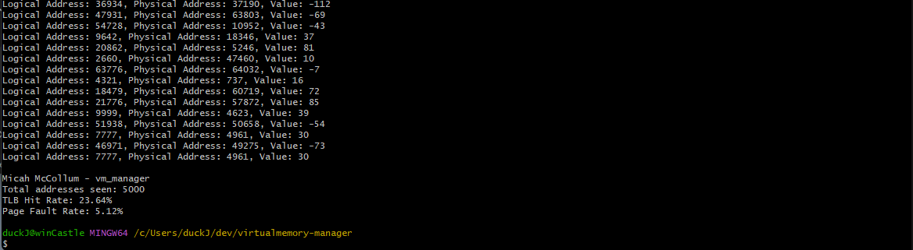

# Virtual Memory Manager (C Project)
**Author**: Micah McCollum  
**Project**: Virtual Memory Simulation and Management
**Language**: C (C11 Standard)  
**Topics**: Page Tables, TLB, Page Faults, Memory Translation
---

## Project Overview

This project is a simulation of a **virtual memory management system** written in C, 
designed to replicate how an OS could effectively manage Logical -> Physical address translations.

This program dynamically handles over 5,000 address translations with minimal page fault rates (~5%) and TLB hit optimization (~25%), thanks to an efficient LRU caching scheme.

It demonstrates:
- Demand-paging with a backing store
- TLB (Translation Lookaside Buffer) with LRU replacement
- Page table management
- Memory translation from logical → physical
- Evaluation stats: page fault rate & TLB hit rate printed on run
---

## Project Features

Simulates:
- Virtual address translation (16-bit logical addresses)  
- Backing store loading (via `BACKING_STORE.bin`)  
- Buffer with size (16-entry) using Least Recently Used (LRU) strategy  
- Page table with 256 page size

Outputs:
- Logical address → physical address → value
- TLB Hit Rate (%)
- Page Fault Rate (%)
- Full name & project ID header
---

## Project Structure
virtualmemory-manager/
├── main.c # Entry point and I/O handler
├── vm_manager.c # Core memory management logic
├── vm_manager.h # Shared constants & function declarations
├── addresses.txt # Input file with logical addresses
├── BACKING_STORE.bin # Simulated secondary storage
├── Makefile # Build automation
├── generate_addresses.py # Script to generate new addresses
├── generate_backing_store.py # Script to generate the back-up storage
└── README.md # Project documentation
---

## Build/Run
Prerequisites
Ensure the following tools are installed:

GCC (GNU Compiler Collection)

Windows: via MinGW

macOS: brew install gcc

Linux: sudo apt install build-essential

Make (optional but recommended for simplified building)

A C-compatible terminal: PowerShell, Git Bash, or Linux shell

## Build
Project can be built with make using the Makefile,

Or with manual compilation:
gcc -Wall -Wextra -std=c11 -o vm_manager main.c vm_manager.c

## Run
After compilation, project can be ran with command:
./vm_manager

